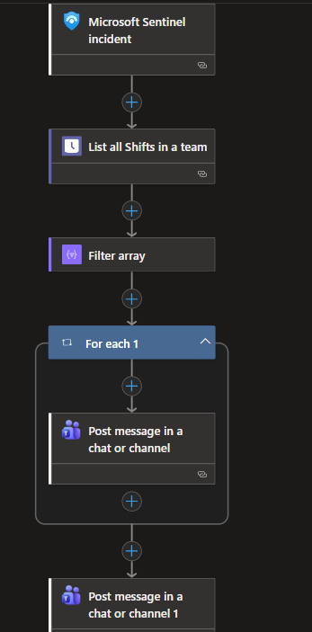

**SIEM Automation Playbooks**
This repository contains automation playbooks applied in SIEM solutions.

**📘 TeamMessage_FOR_HighSeverityIncidents**
A Microsoft Sentinel playbook that triggers automatically when a high severity incident (filterd by automation rule condition) is ingested from any of the following Microsoft Defender products:

Microsoft Defender for Endpoint
Microsoft Defender for Identity
Microsoft Defender for Cloud Apps
Microsoft Defender XDR

Upon trigger, the playbook connects to Microsoft Teams Shifts to identify the currently active employees on shift. It then extracts each user's account ID and sends a Teams direct message notifying all on-shift employees as well as the team manager about the incident.

📄 For full configuration details, see [Configuration](./TeamMessage_FOR_HighSeverityIncidents)

